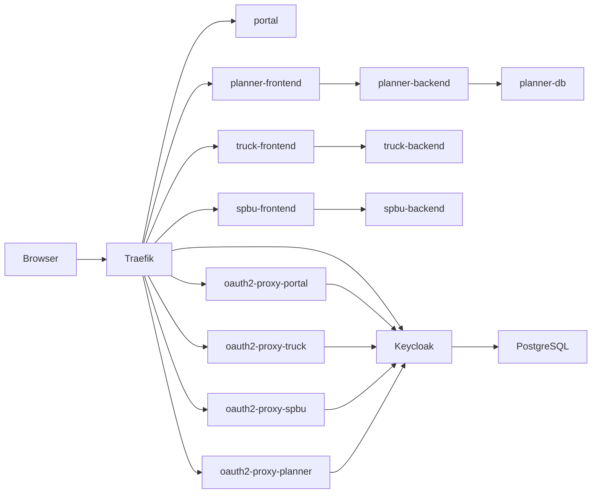

# Local-First Architecture

## Intent

This repository is the shared infrastructure layer for a multi-app VRP platform:

- Truck Master Data
- SPBU Master Data
- VRP Planner
- A future shared portal

The implementation is optimized for local Docker-based development first. It keeps the infrastructure understandable, swap-friendly, and ready to move onto a single Ubuntu VPS later.

## Service Relationships

## Request Flow

### Portal or app access

1. A browser requests `http://portal.localhost` or another app host.
2. Traefik matches the host rule and routes the request to the matching OAuth2 Proxy instance.
3. OAuth2 Proxy checks for a valid session cookie.
4. If no session exists, OAuth2 Proxy redirects the user to Keycloak.
5. After login, OAuth2 Proxy stores the authenticated session and proxies the request to the protected frontend service.

### Keycloak access

1. A browser requests `http://auth.localhost`.
2. Traefik routes the request directly to Keycloak.
3. Keycloak serves the admin console, account pages, and OIDC endpoints.

## Why Phase 1 Uses OAuth2 Proxy

Phase 1 uses OAuth2 Proxy because it minimizes changes needed in the existing business applications:

- It centralizes login before each web app is natively OIDC-aware.
- It lets the platform standardize SSO early.
- It avoids coupling local infra work to framework-specific auth implementations in each app.
- It still keeps the system compatible with future native OIDC integration.

Local mode also uses one OAuth2 Proxy instance per protected hostname. That is deliberate:

- it avoids cookie-domain ambiguity across `*.localhost`
- it keeps each auth flow easy to inspect
- it makes role-based or path-based policy changes per app straightforward later
- it lets container-to-container OIDC discovery stay on an internal URL while browser redirects keep using the public host and port

## Roles in the Realm

The Keycloak bootstrap creates the `vrp-platform` realm and these realm roles:

- `admin`
- `ops`
- `masterdata_truck`
- `masterdata_spbu`
- `planner_user`
- `vrp_user`
- `viewer`

These are intentionally simple phase-1 roles. Applications can later map them into finer-grained permissions.

## Private vs Public Services

Public HTTP entrypoints:

- `portal`
- `truck-frontend`
- `spbu-frontend`
- `planner-frontend`
- `keycloak`
- per-app `oauth2-proxy` endpoints under `/oauth2/*`

Private-only services:

- `truck-backend`
- `spbu-backend`
- `planner-backend`
- `planner-db`
- `keycloak-db`

The backends stay off Traefik by default. This matches the stated goal that internal services remain private unless explicitly needed.

## Future Native OIDC Path

This repo keeps a clean migration path for native OIDC in each app:

1. Keep Keycloak as the central identity provider and role source.
2. Add app-specific native OIDC clients in Keycloak.
3. Remove OAuth2 Proxy in front of apps that are ready.
4. Keep Traefik only as the reverse proxy and host router.

That migration can happen app by app. The phase-1 design does not block that evolution.
